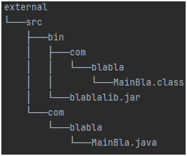
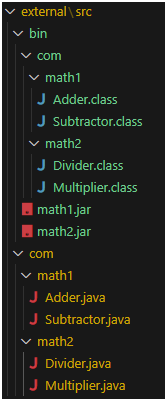
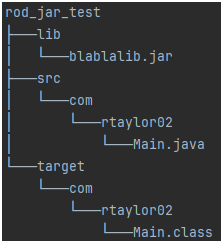
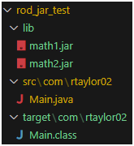

# README
This folder contains all Java core topics:

## Jar
This section contains everything about jar.


To make jar file: `$ jar -cvf <a> [<b>] <c>`  
`a`: arbitrary name for your jar file  
`b`: OPTIONAL - fully qualified name of the class containing main() ==> for executable jar ONLY  
`c`: list of all .class files to be included in the jar; separated by ' ' (space)

To compile with 3rd party jar included in our project: `$ javac -cp <a> <b>`  
`a`: location of .class file of your own project + jar files, separated by ; (Windows) or : (Linux). NOTE: For Windows, enclose this in quotes "".  
`b`: java files to be compiled

### Example - Create a Single Jar File Containing Single Class File 
Our external 3rd party lib project structure is like below:  
  


#### Steps
***NOTE***: `$` is a short form of `...\external\src $` for current directory  
1. Compile: `$ javac -d bin com\blabla\MainBla.java` ==> this create *MainBla.class* in *bin* folder
2. Change directory to `bin` where `com.blabla.Main.class` is located: `$ cd bin`
3. Create jar: `..\bin $ jar -cvf blablalib.jar com\blabla\MainBla.class`
4. Check jar contents: `..\bin $ jar -tf blablalib.jar`:
    ```
    META-INF/
    META-INF/MANIFEST.MF
    com/blabla/MainBla.class
    ```
### Example - Create a Multiple Jar Files Containing Multiple Class Files
Our external 3rd party lib project structure is like below:  
  
*NOTE*: `bin` folder is only created in step 1 below containing class files
#### Steps
***NOTE***: `$` is a short form of `...\external\src $` for current directory
1. Compile: `$ javac -d bin com\math1\*.java com\math2\*.java` ==> this create *.class* files in *bin* folder
2. Change directory to `bin` where `com.blabla.Main.class` is located: `$ cd bin`
3. Create jars:  
   a. `..\bin $ jar -cvf math1.jar com\math1\*.class`  
   b. `..\bin $ jar -cvf math2.jar com\math2\*.class`
4. Check jars contents:  
   a. `..\bin $ jar -tf math1.jar`:
   ```
   META-INF/
   META-INF/MANIFEST.MF
   com/math1/Adder.class
   com/math1/Subtractor.class
   ```
   b. `..\bin $ jar -tf math2.jar`:  
   ```
   META-INF/
   META-INF/MANIFEST.MF
   com/math2/Divider.class
   com/math2/Multiplier.class
   ```

### Example - Include a Jar File Into Our Project
Example:  
We have a project called rod_jar_test with structure below. The 3rd party jars are stored in *lib* folder.  


Code: 
```
package com.rtaylor02;

import com.blabla.MainBla;

public class Main {
    public static void main(String[] args) {
        MainBla mainBla = new MainBla();
        System.out.println("Result: " + mainBla.add1(2));
    }
}
```

#### Steps
***NOTE***: `$` is a short form of `...\rod_jar_test $` for current directory
1. Copy and paste the lib jar(s) to *lib* folder
2. Compile our project: `$ javac -d target -cp lib\blablalib.jar src\com\rtaylor02\Main.java` ==> this create *Main.class* in *target* folder
2. Execute our project: `$ java -cp "target;lib\blablalib.jar" com.rtaylor02.Main`.
    > Double quotes `"` in *-cp* can also be single quotes `'`

Result:
```
Result: 3
```
### Example - Include Multiple Jar Files Into Our Project
Example:  
We have a project called rod_jar_test with structure below. The 3rd party jars are stored in *lib* folder.  
  
*NOTE*: `target` folder is only created in step 2 below following compilation

Code:
```
package com.rtaylor02;

import com.math1.Adder;
import com.math1.Subtractor;
import com.math2.Divider;
import com.math2.Multiplier; 

public class Main {
    public static void main(String[] args) {
        Adder adder = new Adder();
        System.out.println("add(1, 2) = " + adder.add(1, 2));

        Subtractor subtractor = new Subtractor();
        System.out.println("subtract(2, 1) = " + subtractor.subtract(2, 1));

        Divider divider = new Divider();
        System.out.println("divide(6, 2) = " + divider.divide(6, 2));

        Multiplier multiplier = new Multiplier();
        System.out.println("multiply(2, 2) = " + multiplier.multiply(2, 2));
    }
}
```

#### Steps
***NOTE***: `$` is a short form of `...\rod_jar_test $` for current directory
1. Copy and paste the lib jar(s) to *lib* folder
2. Compile our project: `$ javac -d target -cp 'lib\math1.jar;lib\math2.jar' src\com\rtaylor02\Main.java` ==> this create *Main.class* in *target* folder
2. Execute our project: `$ java -cp 'lib\math1.jar;lib\math2.jar;target' com.rtaylor02.Main`.
   > Double quotes `"` in *-cp* can also be single quotes `'`

Result:
```
add(1, 2) = 3
subtract(2, 1) = 1
divide(6, 2) = 3
multiply(2, 2) = 4
```
