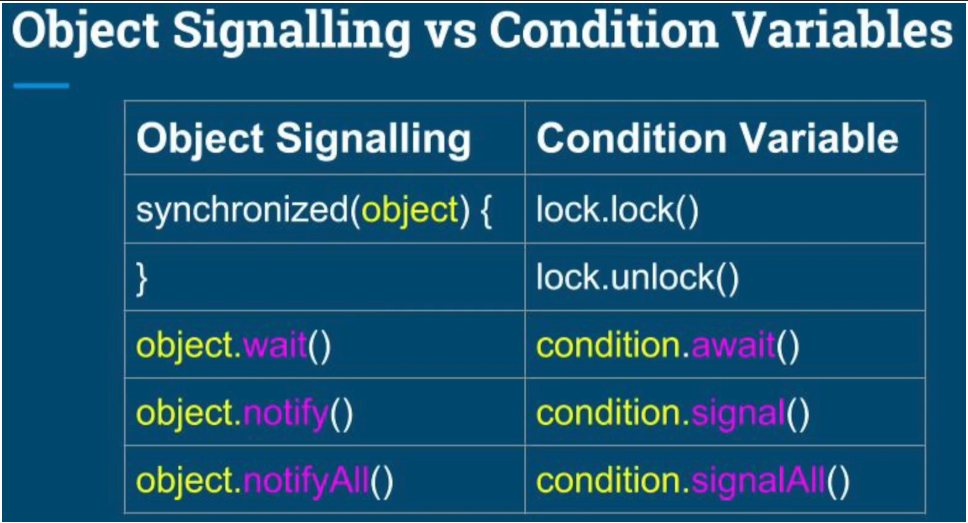

# Introduction
All multi-threading and concurrency material.

The folder structure resembles [Michael Pogrebinsky course](https://ba.udemy.com/course/java-multithreading-concurrency-performance-optimization/learn/lecture/11200058#overview) as the structure k
is considered good.

# Source
1. [Java Multithreading, Concurrency & Performance Optimisation](https://ba.udemy.com/course/java-multithreading-concurrency-performance-optimization/learn/lecture/11200058#overview) by Michael Pogrebinski
2. [Java Concurrency and Multithreading in Practice](https://learning.oreilly.com/videos/-/9781789806410/) by Tatiana Fesenko
3. [Java Thread Demystified](https://learning.oreilly.com/live-events/java-threads-demystified/0642572004012/) by Maurice Naftalin

# Pointers
## 1 - Thread Fundamentals - Creation and Coordination
- Motivation for multi-threading application:
  - responsiveness
  - performance  


- Forms of thread coordination:
  - interrupt: 
    - `thread.interrupt()`
    - `thread.isInterrupted()`
  - waiting:
    - `thread.join([long[, int]])`
    - `object.wait([long[, int]])` & `object.notify()` / `object.notifyAll()` ==> `synchronized` needed. see section 3 & 4 for this as this is more for sharing data between threads.
      - `thread.onSpinWait()`==> no `synchronized` needed as thread, unlike `wait()` does not go into WAIT state. ALWAYS enclose this method in `while(<flag>)` loop.

## 2 - Performance Optimisation - Latencies and Throughput
- Throughput = #transaction / unit time


- For optimised throughput:
    - \# threads = # cores. More is counterproductive
    - Use Fixed Thread Pool ==> eliminate the cost of recreating the threads
    - Best strategy: each request is handled by 1 thread


- Use JMeter to measure throughput of our application:
    

## 3 - Data Sharing between Threads
- Memory regions:
    - heap (shared): objects, class members, static variables
    - stack (exclusive): local primitive types, local references (to objects on heap)


- Atomic operation ==> single step - ***'ALL or NOTHING'***

## 4 - Concurrency Challenges and Solutions
  | Challenges                                                                                              | Solution                                                                                                                                                                                                                                                                        |
  |---------------------------------------------------------------------------------------------------------|---------------------------------------------------------------------------------------------------------------------------------------------------------------------------------------------------------------------------------------------------------------------------------|
  | Shared-resource inconsistency (Racing Condition & Data Race) - at least 1 thread modifying the resource | Every shared variable should be:<br/>- Guarded by a `synchronized` block or a lock<br/>- `volatile` ==> guaranteed order (or *happens-before*) ==> sequence of flanking statements of a `volatile` variable are guaranteed (i.e. excluded from re-ordering by JIT optimisation) |
  | Deadlock                                                                                                | ALWAYS use locks with the **same order** ==> avoid ***circular lock chain***                                                                                                                                                                                                    |


- Race condition and data race:
  - Race condition: due to non-atomic operation (e.g. x++) in the logic and leads to incorrect behaviour. Solution: synchronized critical section
  - Data race: due to compiler and CPU instruction re-ordering for optimised HW utilisation and performance. Solution: 'volatile' shared variables. Use of 'synchronized' in data race is rarely needed and can affect performance.


- `volatile` ==> keeping the order of statements: all instructions before, stay before; all instructions after, stay after. 


- Critical section of the code = code block that can lead to data race or racing condition


- Atomic operation = an operation done within 1 CPU clock.
  - Primitive (except `long` and `double`) read & write ==> use `volatile` to guarantee atomic `long` & `double` R/W ops.
  - Reference read & write


- Locking:
  - Coarse-grained locking: `synchronized` method --> slow
  - Fine-grained locking: `synchronized` sections --> faster, but can cause deadlock due to multiple locks


- Reentrant-lock = using the same lock, a thread can enter different `synchronized` sections/methods


- Lock is just an object replacement for `synchronized(this)` statement or `synchronized` method with the objectives of:
  1. More flexibility: any object can take the lock (and forget to unlock!), but with `synchronized`, the thread has to be inside the object.
  2. More control
  ```
  public void increment() {
      synchronized (this) {
          data++;
      }
  }
  ```  
  is equivalent to:
  ```
  public synchronized void increment() {
      data++;
  }
  ```
  is equivalent to:
  ```
  private Object lock = new Object();
  public void increment() {
      synchronized (lock) {
          data++;
      }
  }
  ```
  > There can be ***ONE*** thread executing any `synchronized` statement/method at any point.   
  > Thus, it is analogous to 1 public toilet with 1 key(monitor).. :) with 1 difference: `synchronized` is like a slot key, i.e. you have to be inside the toilet to lock it; Lock is like a key that any object can carry around and forget to bring it back and unlock!

  > An owner of a monitor = a *runnable-state* thread that is currently executing any `synchronized` statement/method.

  > `wait()` & `notify()` / `notifyAll()`: ONLY invoked by the owner of the monitor. 
  > 
  > `wait()` relinquishes the monitor at the point of execution, but `notify()` / `notifyAll()` relinquishes the monitor at the end of `synchronized` statement/method. 


# Advanced Locking
- [ReentrantLock](https://docs.oracle.com/en/java/javase/23/docs/api/java.base/java/util/concurrent/locks/ReentrantLock.html):
  - just like `sychronized(lockObject) {...}` but with `lock()`-`unlock()` and control on fairness - `ReentrantLock(true)`. Also, with useful methods:
    - `getQueuedThreads()`
    - `getOwner()`
    - `isHeldByCurrentThread()`
    - `isLocked()`
  - when not careful, possible *deadlock* issue. To prevent:
    - ALWAYS put it within `try-finally` block ==> so lock is ALWAYS released in the event of exception or mishap of forgetting
    - use of `lockInterruptibly()` or `tryLock(long, TimeUnit)` ==> so application is never gone into deadlock, or not blocked at all
   
 
- [ReentrantReadWriteLock](https://docs.oracle.com/en/java/javase/23/docs/api/java.base/java/util/concurrent/locks/ReentrantReadWriteLock.html):
  - Just like ReentrantLock but with `readLock()` and `writeLock()` as `Lock` objects to specify reading and writing operations respectively
  - Read section protected by read-lock can be entered by multiple threads but only 1 thread can enter writing section protected by write-lock. Mutual exclusivity between locks are maintained:
    - No threads can enter read-locked section when write-lock is acquired
    - No threads can enter write-locked section when read-lock is acquired
  - Use it for better performance when reading operation is predominant and short. ***NOTE***: better performance is not guaranteed. Always measure and validate 


# Inter-Thread Communication
- 3 ways to do inter-thread communication:
  - Semaphore
  - Condition
  - Object


- Whenever we use Queue, we should:
  1. apply backpressure to avoid OutOfMemoryException by making the producer wait when capacity is reaching max and allow consumer to take the pressure off. 
  2. limit the size of the queue.

## Semaphore
- Dependency: -

- Semaphore = permits. We specify, via constructor, how many permits to give, e.g. `Semaphore s = new Semaphore(3)`. Any critical blocks can be managed using `acquire()` method which can be entered by any thread if they have a permit.  


- Semaphore is a special type of Condition (see below) that is not tied to a lock. One important difference: `release()` gives permit regardless any thread tries `acquire()` or not; `signal()` will ONLY wakes up 1 thread that have invoked `await()`. 


- Methods:
  - `acquire()`: thread sleeps until a permit is available
  - `release([int n])`: release n number of permits. If not specified, releases just 1 permit of the relevant Semaphore.

## Condition
- Dependency: Lock ==> invoked via a Lock: `lock.condition()`


- Always used in a `while(<flag>)` loop:
  ```
  lock.lock();
  ...
  while (!setupConcluded) {
    await();
  }
  ...
  lock.unlock()
  ```


- Methods:
  - await: sleep and release the lock to allow other threads fulfil the condition.
    - `await([long, TimeUnit])`: sleeps indefinitely until signalled, or as specified
    - `awaitNanos(long)`: sleeps no longer than specified
    - `awaitUntil(Date)`: sleeps  no later than date specified
  - signal:  if no awaiting thread, it does nothing. **<ins>IMPORTANT</ins>**: awaiting thread still needs to get the lock from the signalling thread.:
    - `signal()`: wakes up 1 ONLY (any) awaiting thread on the Condition.
    - `signalAll()`: wakes all awaiting threads ==> unlike Semaphore that requires prior knowledge on how many permits to release.
  

## Object
- Dependency: `synchronized` statement as it is used in a <ins>shared</ins> object.


- Always used in a `synchronized` block as a lock. The state flag is always in a `while()` loop:
  ```
  private boolean setupCompleted = false;
  ...
  private void doSomething() {
    synchronized(this) {
      while (!setupCompleted) {
        wait();
      }
    }
    doOtherStuff();
  }
  
  private void doSomeSetup() {
    synchonized(this) {
      ...
      setupCompleted = true;
    }
  }
  ```
  > You can also use `synchronized` method for the above example

- Methods:
  - `wait()`: sleeps until notified
  - `notify()` or `notifyAll()`: wakes one or all threads waiting for the object's flag to change state. 


- Comparison with Lock-Condition pair:
  


